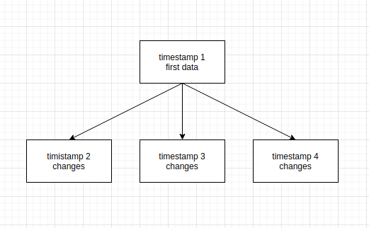

#### **Some variants of how implement historical data strucrtures:**
1) Json with structures 

```
{
    timestamp1:{initial data},
    timestamp2:{changes},
    timestamp3:{changes}
}
```
This variant of data structures is not optimized for database storage. When we need access to this data. And acces by key within object need time and resources.

2) Tree 

[Tree in Go](https://ieftimov.com/post/golang-datastructures-trees/)

Here is question : Why we need a tree if data will updated in series? 
We can store data look like this (see image)


3) TreeSet

[TreeSet in Go](https://github.com/emirpasic/gods/tree/master/sets/treeset)

* [Theory about TreeSet from geeksforgeeks](https://www.geeksforgeeks.org/treeset-in-java-with-examples/) 
1)TreeSet implements the SortedSet interface so duplicate values are not allowed.
2)Objects in a TreeSet are stored in a sorted and ascending order.
3)TreeSet does not preserve the insertion order of elements but elements are sorted by keys.
4)TreeSet does not allow to insert Heterogeneous objects. It will throw classCastException at Runtime if trying to add hetrogeneous objects.
5)TreeSet serves as an excellent choice for storing large amounts of sorted information which are supposed to be accessed quickly because of its faster access and retrieval time.
6)TreeSet is basically implementation of a self-balancing binary search tree like Red-Black Tree. Therefore operations like add, remove and search take O(Log n) time. And operations like printing n elements in sorted order takes O(n) time.

4) TreeBidiMap

[TreeBidiMap in Go](https://github.com/emirpasic/gods/tree/master/maps/treebidimap)

I found this definition of TreeBidiMap

* BidiMap is an interface which defines map which allows mapping from key to value as well as from value to key (thus "bidirectional"). TreeBidiMap is the implementation of this interfaces which uses red-black tree.
